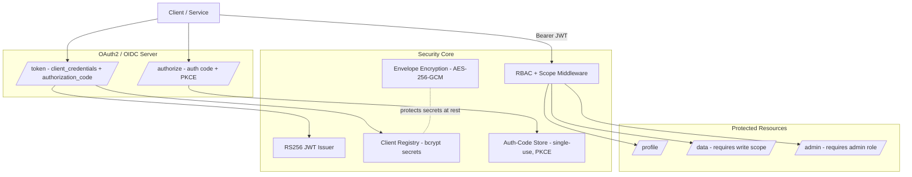
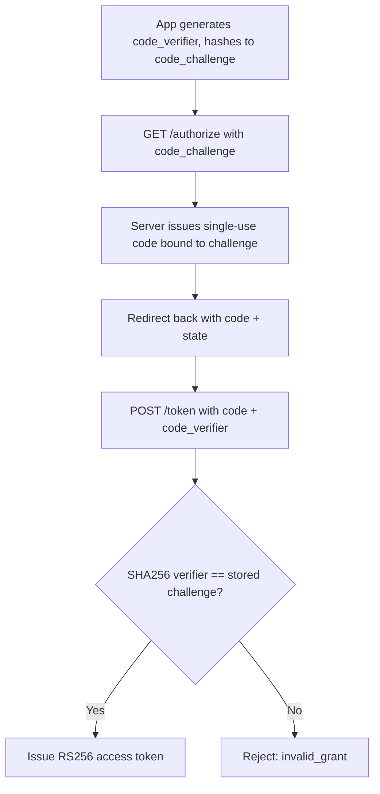
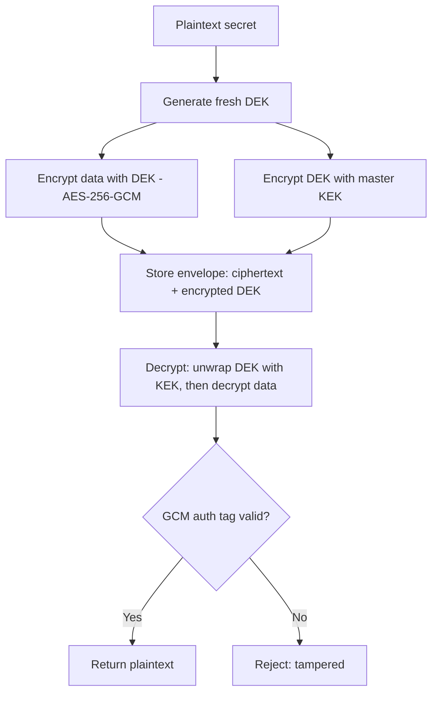

# SentinelIAM — An OAuth2 / OIDC Identity & Access Platform in Go

**SentinelIAM** is a security-focused identity and access-management server built from scratch in **Go**. It implements **OAuth2** grant flows (client-credentials and authorization-code with PKCE), **RS256 JWT** issuance and validation, **RBAC + scope-based** access control, and **envelope encryption** (AES-256-GCM) for secrets-at-rest — demonstrating the authentication, authorization, and applied-cryptography primitives behind enterprise IAM.

## Motivation

Every platform depends on secure authentication and fine-grained authorization. Rather than wrapping a managed identity provider, SentinelIAM implements the actual protocols and cryptographic building blocks — OAuth2 flows, JWT signing, PKCE, RBAC, and envelope encryption — to show how enterprise IAM works under the hood.

## Key Features

- **OAuth2 flows**
  - **Client-credentials** (service-to-service) with bcrypt-hashed client secrets and scope validation.
  - **Authorization-code with PKCE (S256)** — the secure flow for public clients; single-use, short-lived codes bound to the issuing client.
- **RS256 JWT** — asymmetric signing (private key signs, public key verifies); validation checks signature, expiry, and signing method (**algorithm-confusion protection**).
- **RBAC + scope enforcement** — composable middleware gating protected resources by role and OAuth scope.
- **Envelope encryption** — per-secret Data Encryption Keys (DEKs) wrapped by a master Key Encryption Key (KEK), using **AES-256-GCM** authenticated encryption (confidentiality + tamper detection).
- **Security hardening** — bcrypt secret hashing, constant-time PKCE comparison, timing-attack mitigation on unknown clients, fresh DEK + nonce per encryption.
- **Comprehensive tests** — JWT lifecycle, both OAuth flows, PKCE, RBAC/scope, and envelope encryption.

## Architecture



## Request Flows

### Authorization-Code Flow with PKCE



### Envelope Encryption



## Components

| Package | Responsibility | Concepts |
|---|---|---|
| `token` | RSA key pair, RS256 JWT issue/validate | JWT, asymmetric crypto, alg-confusion protection |
| `client` | Client registry, bcrypt secret auth | credential hashing, timing mitigation |
| `authcode` | Single-use codes + PKCE verification | OAuth2, PKCE (S256), constant-time compare |
| `server` | `/authorize`, `/token`, RBAC/scope middleware | OAuth2 flows, access control |
| `crypto` | AES-256-GCM, envelope encryption | authenticated encryption, DEK/KEK, key rotation |

## Project Structure

```
cmd/server/main.go              # entry point (server + demo-crypto mode)
internal/
├── token/                      # RSA keys + RS256 JWT
│   ├── keys.go, jwt.go, id.go
├── client/                     # client registry (bcrypt secrets)
│   └── client.go
├── authcode/                   # authorization codes + PKCE
│   ├── authcode.go, pkce.go
├── server/                     # OAuth endpoints + middleware
│   ├── oauth.go, middleware.go, resource.go
└── crypto/                     # envelope encryption
    ├── aesgcm.go, envelope.go, errors.go
```

## Build & Run

### Prerequisites
- Go 1.21+

### Test
```bash
go test ./...
```

### Run the server
```bash
go run ./cmd/server
```

### Demo: OAuth2 + RBAC (curl)
```bash
# client-credentials -> access token
TOKEN=$(curl -s -u service-a:s3cr3t \
  -d 'grant_type=client_credentials&scope=read write' \
  http://localhost:8080/token | grep -o '"access_token":"[^"]*"' | cut -d'"' -f4)

curl -s -H "Authorization: Bearer $TOKEN" http://localhost:8080/profile   # any valid token
curl -s -H "Authorization: Bearer $TOKEN" http://localhost:8080/data      # requires write scope
curl -s -H "Authorization: Bearer $TOKEN" http://localhost:8080/admin     # requires admin role
curl -s http://localhost:8080/profile                                     # 401 without token
```

### Demo: envelope encryption
```bash
go run ./cmd/server demo-crypto
```

## Design Decisions

**RS256 over HS256** — Asymmetric signing lets resource servers verify tokens with only the public key; the signing secret never leaves the auth server. Validation explicitly checks the signing method to prevent algorithm-confusion attacks.

**PKCE mandatory for the auth-code flow** — Protects public clients (SPAs, mobile) from authorization-code interception; a stolen code is useless without the verifier, which never leaves the client. Verification uses constant-time comparison.

**bcrypt for client secrets** — Secrets are stored hashed with per-hash salt, never plaintext. Unknown clients still trigger a bcrypt comparison against a dummy hash to mitigate timing-based client enumeration.

**Single-use, short-lived authorization codes** — Consumed atomically under a mutex and bound to the issuing client, defending against replay and code-injection.

**Envelope encryption (DEK/KEK)** — Each secret gets a fresh DEK; only DEKs are wrapped by the master KEK. Rotating the KEK re-wraps small DEKs instead of re-encrypting all data, and a compromised DEK affects a single secret. AES-256-GCM provides authenticated encryption (tamper detection).

**Composable middleware** — Access control is expressed as chained handler wrappers (`Authenticate → RequireScope/RequireRole → resource`), with validated claims passed via `context.Context`.

## Roadmap
- OIDC layer: ID tokens, discovery document, JWKS endpoint with key rotation
- Refresh tokens with rotation + reuse detection
- Attribute-based access control (ABAC) alongside RBAC
- Token introspection + revocation (denylist)
- Persistent client store (PostgreSQL) and secrets encrypted at rest via the envelope layer
- TLS / mTLS for confidential clients

## License
MIT

---