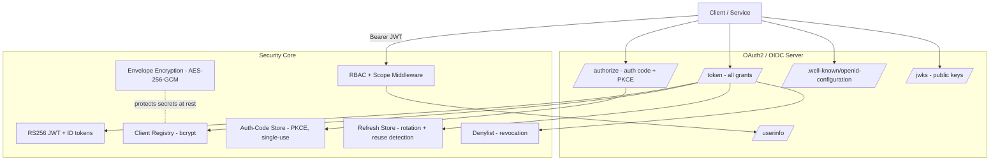
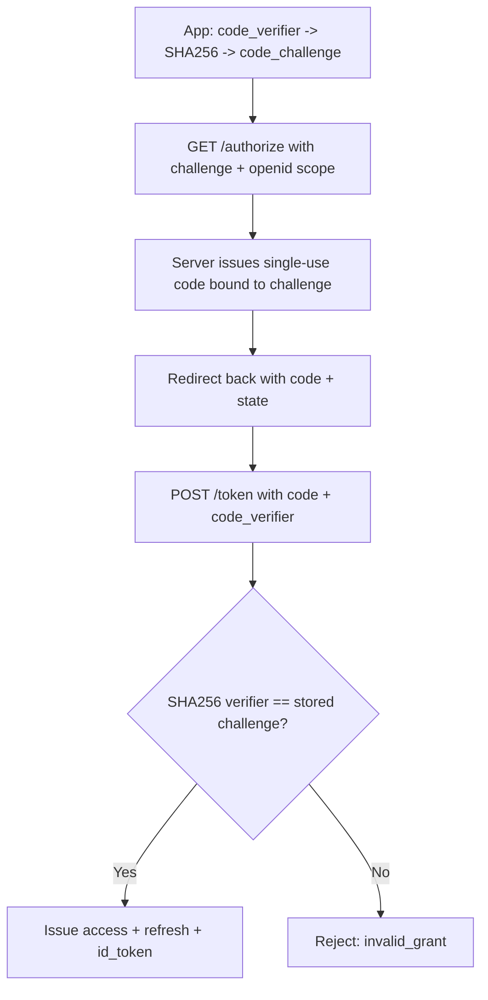
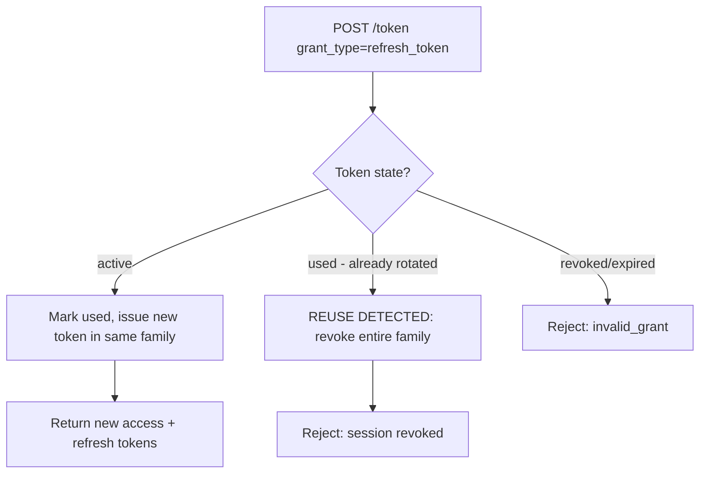
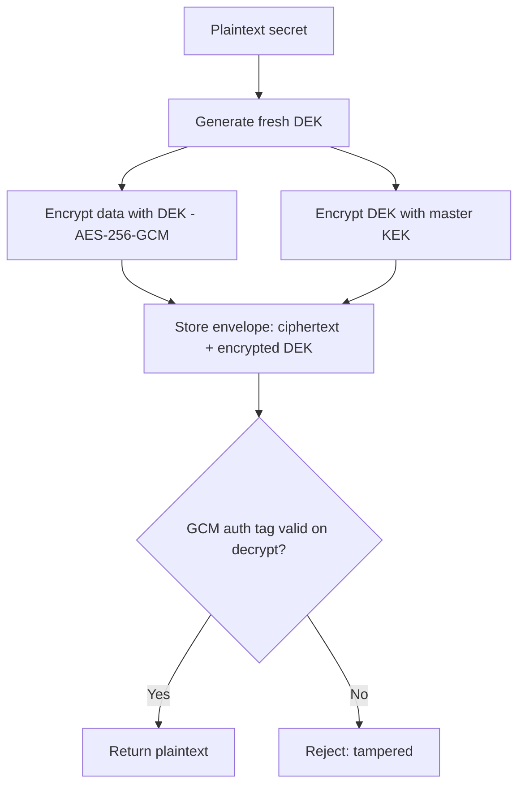

# SentinelIAM — An OAuth2 / OIDC Identity & Access Platform in Go

**SentinelIAM** is a security-focused identity and access-management server built from scratch in **Go**. It implements a full **OpenID Connect (OIDC)** provider on top of **OAuth2** — authorization-code (with PKCE) and client-credentials flows, **RS256 JWT** issuance/validation, ID tokens, a JWKS endpoint, refresh-token rotation with reuse detection, token introspection/revocation, RBAC + scope access control, and **envelope encryption** (AES-256-GCM) for secrets-at-rest.

## Motivation

Every platform depends on secure authentication and fine-grained authorization. Rather than wrapping a managed identity provider, SentinelIAM implements the actual protocols and cryptographic primitives behind enterprise IAM — OAuth2/OIDC flows, JWT signing, PKCE, refresh rotation, revocation, and envelope encryption — to show how identity infrastructure works under the hood.

## Key Features

- **OAuth2 flows** — client-credentials (bcrypt-hashed secrets, scope validation) and authorization-code with **PKCE (S256)** (single-use, short-lived codes bound to the issuing client).
- **OpenID Connect** — **ID tokens** (issued for the `openid` scope, addressed to the client), **JWKS endpoint** (`kid`-keyed public keys for independent verification + rotation), a **discovery document**, and a **/userinfo** endpoint.
- **RS256 JWT** — asymmetric signing; validation checks signature, expiry, and signing method (**algorithm-confusion protection**); tokens carry a `kid` for key selection.
- **Refresh tokens with rotation + reuse detection** — each refresh is single-use; replaying a rotated token triggers **family revocation** (theft detection).
- **Token introspection (RFC 7662) + revocation (RFC 7009)** — real-time token status and revocation via a **JTI denylist**.
- **RBAC + scope enforcement** — composable middleware gating resources by role and OAuth scope.
- **Envelope encryption** — per-secret DEKs wrapped by a master KEK, using **AES-256-GCM** authenticated encryption (confidentiality + tamper detection).
- **Security hardening** — bcrypt, constant-time comparisons, timing-attack mitigation, fresh DEK + nonce per encryption.
- **Comprehensive tests** across every component.

## Architecture



## Request Flows

### Authorization-Code + PKCE + OIDC



### Refresh-Token Rotation + Reuse Detection



### Envelope Encryption



## Endpoints

| Endpoint | Description |
|---|---|
| `GET /authorize` | Start auth-code flow (PKCE required) |
| `POST /token` | Issue tokens (client_credentials / authorization_code / refresh_token) |
| `POST /introspect` | Token status (RFC 7662) |
| `POST /revoke` | Revoke a token (RFC 7009) |
| `GET /.well-known/openid-configuration` | OIDC discovery document |
| `GET /jwks` | Public signing keys (JWKS) |
| `GET /userinfo` | OIDC user claims (protected) |
| `GET /profile` `/data` `/admin` | Protected resources (scope/role gated) |

## Project Structure

```
cmd/server/main.go              # entry point (server + demo-crypto mode)
internal/
├── token/                      # RSA keys, RS256 JWT, ID tokens, denylist
│   ├── keys.go, jwt.go, idtoken.go, id.go, denylist.go
├── client/                     # client registry (bcrypt secrets)
├── authcode/                   # authorization codes + PKCE
├── refresh/                    # refresh tokens (rotation + reuse detection)
├── server/                     # OAuth/OIDC endpoints + middleware
│   ├── oauth.go, refresh.go, introspect.go
│   ├── jwks.go, discovery.go, userinfo.go
│   ├── middleware.go, resource.go
└── crypto/                     # envelope encryption (AES-256-GCM)
```

## Build & Run

```bash
go test ./...
go run ./cmd/server            # start the server on :8080
go run ./cmd/server demo-crypto # envelope encryption demo
```

### OIDC demo
```bash
curl -s http://localhost:8080/.well-known/openid-configuration   # discovery
curl -s http://localhost:8080/jwks                               # public keys
```

## Design Decisions

**RS256 + JWKS over HS256** — Asymmetric signing lets relying parties verify tokens with the published public key (via JWKS, keyed by `kid`); the signing key never leaves the server, and keys can be rotated by publishing a new one. Validation explicitly checks the signing method to prevent algorithm-confusion attacks.

**PKCE mandatory for the auth-code flow** — Protects public clients from code interception; verification uses constant-time comparison.

**Refresh rotation with reuse detection** — Refresh tokens are single-use; replaying a rotated token signals theft, so the entire token family is revoked, forcing re-authentication. This is how modern IdPs detect stolen refresh tokens.

**Stateless JWTs + a denylist for revocation** — JWTs validate offline, while a JTI denylist (TTL = token lifetime) enables real-time revocation without a database round-trip on every request.

**bcrypt + timing mitigation** — Client secrets are hashed; unknown clients still trigger a dummy bcrypt comparison to prevent timing-based enumeration.

**Envelope encryption (DEK/KEK)** — Each secret gets a fresh DEK; only DEKs are wrapped by the master KEK, so key rotation re-wraps small keys instead of re-encrypting all data. AES-256-GCM provides authenticated encryption (tamper detection).

## Roadmap
- Attribute-based access control (ABAC) alongside RBAC
- Persistent client store (PostgreSQL) with secrets encrypted via the envelope layer
- TLS / mTLS for confidential clients
- Multiple active signing keys in JWKS for zero-downtime rotation

## License
MIT

---